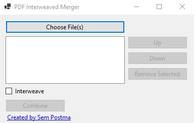

## MergeEvenOddPDF

Merge even and odd documents. Interweaving also works with 3 or more documents. Combining PDF's one after another is also supported.

 

## How to download?

- Go the the lastest release under "Releases". 
- Download the PDF_Interweaved_Merge.zip file.
- When you first run the program, you may be prompted to install .NET 6 if you haven't installed it already.

## License

MIT
